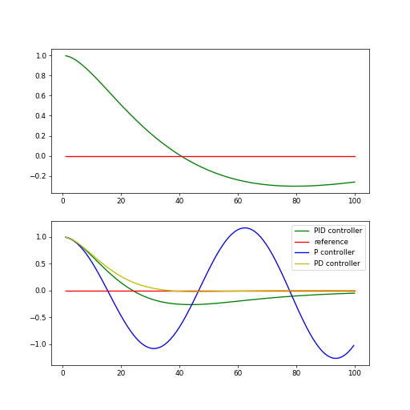

# Self-Driving Car Engineer Nanodegree Program
## CarND-Controls-PID Project

---
### Overview
The main purpose of this project is to build a PID(Proportional/Integral/Differential) controller that responds to the cars primary controls steering, throttle and breaks. The PID process also needs to be successfully tested using a graphical simulator that drives a car on a single lane track that captures speed, Cross Track Errors(CTE) and steering angle. The PID controller must respond to the the data captured by the simulator and perform adjustments to successful finish driving through the track without touching the edges.

---
### Tuning and Observations

#### How P, I and D components effect PID controller
P Component - It can be inferred that the P(Proportional) component has direct effect on cars movement. The car needs to steer in inverse proportional to the center of the lane which is identified by Cross Track Errors(CTE). It also a measure of natural adjustment we do while driving cars. For example if the lane curves to the left the car's alignment and tendency to turn right needs to the corrected by steering left.

D Component - The Differential(D) component compliments the P component's snake movement defined as overshoot and ring motion. A well tuned D parameter ensures smooth steering motion and reduces snake like motion through the driving lane. Without D component the CTE will be higher.

I Component - The Integral(I) component counters the systematic bias that could cause the other PD components avoid car steering towards the center due to factors like steering drift, speed noise and distance noise. The I component ensured that the car drove well at curves.

#### How P, I and D components were chosen
The initial values of Kp=0.2, Ki = 0.004 and Kd = 3.0 were chosen from lessons by checking the x_trajectory and y_trajectory plots in Python code that gave a good rule of thumb on how the PID controls could effect the behavior. The values were tuned down to achieve desired effect before implementing Twiddle algorithm. The final values chosen were Kp = 0.1, Ki = 0.0002 and Kd = 3.0 which gave the best result. The graphical plot produced by Python code for these values is given below:


The light green shows the plot for PID controller tuned for these purposes.

---

## Dependencies

* cmake >= 3.5
 * All OSes: [click here for installation instructions](https://cmake.org/install/)
* make >= 4.1
  * Linux: make is installed by default on most Linux distros
  * Mac: [install Xcode command line tools to get make](https://developer.apple.com/xcode/features/)
  * Windows: [Click here for installation instructions](http://gnuwin32.sourceforge.net/packages/make.htm)
* gcc/g++ >= 5.4
  * Linux: gcc / g++ is installed by default on most Linux distros
  * Mac: same deal as make - [install Xcode command line tools]((https://developer.apple.com/xcode/features/)
  * Windows: recommend using [MinGW](http://www.mingw.org/)
* [uWebSockets](https://github.com/uWebSockets/uWebSockets)
  * Run either `./install-mac.sh` or `./install-ubuntu.sh`.
  * If you install from source, checkout to commit `e94b6e1`, i.e.
    ```
    git clone https://github.com/uWebSockets/uWebSockets
    cd uWebSockets
    git checkout e94b6e1
    ```
    Some function signatures have changed in v0.14.x. See [this PR](https://github.com/udacity/CarND-MPC-Project/pull/3) for more details.
* Simulator. You can download these from the [project intro page](https://github.com/udacity/self-driving-car-sim/releases) in the classroom.

There's an experimental patch for windows in this [PR](https://github.com/udacity/CarND-PID-Control-Project/pull/3)

## Basic Build Instructions

1. Clone this repo.
2. Make a build directory: `mkdir build && cd build`
3. Compile: `cmake .. && make`
4. Run it: `./pid`.

## Editor Settings

We've purposefully kept editor configuration files out of this repo in order to
keep it as simple and environment agnostic as possible. However, we recommend
using the following settings:

* indent using spaces
* set tab width to 2 spaces (keeps the matrices in source code aligned)

## Code Style

Please (do your best to) stick to [Google's C++ style guide](https://google.github.io/styleguide/cppguide.html).

## Project Instructions and Rubric

Note: regardless of the changes you make, your project must be buildable using
cmake and make!

More information is only accessible by people who are already enrolled in Term 2
of CarND. If you are enrolled, see [the project page](https://classroom.udacity.com/nanodegrees/nd013/parts/40f38239-66b6-46ec-ae68-03afd8a601c8/modules/f1820894-8322-4bb3-81aa-b26b3c6dcbaf/lessons/e8235395-22dd-4b87-88e0-d108c5e5bbf4/concepts/6a4d8d42-6a04-4aa6-b284-1697c0fd6562)
for instructions and the project rubric.

## Hints!

* You don't have to follow this directory structure, but if you do, your work
  will span all of the .cpp files here. Keep an eye out for TODOs.

## Call for IDE Profiles Pull Requests

Help your fellow students!

We decided to create Makefiles with cmake to keep this project as platform
agnostic as possible. Similarly, we omitted IDE profiles in order to we ensure
that students don't feel pressured to use one IDE or another.

However! I'd love to help people get up and running with their IDEs of choice.
If you've created a profile for an IDE that you think other students would
appreciate, we'd love to have you add the requisite profile files and
instructions to ide_profiles/. For example if you wanted to add a VS Code
profile, you'd add:

* /ide_profiles/vscode/.vscode
* /ide_profiles/vscode/README.md

The README should explain what the profile does, how to take advantage of it,
and how to install it.

Frankly, I've never been involved in a project with multiple IDE profiles
before. I believe the best way to handle this would be to keep them out of the
repo root to avoid clutter. My expectation is that most profiles will include
instructions to copy files to a new location to get picked up by the IDE, but
that's just a guess.

One last note here: regardless of the IDE used, every submitted project must
still be compilable with cmake and make./
